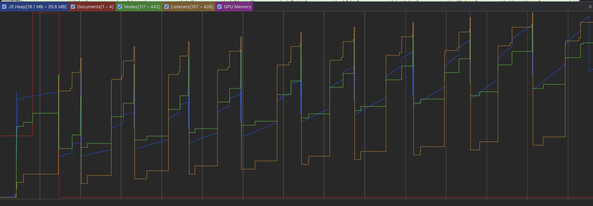
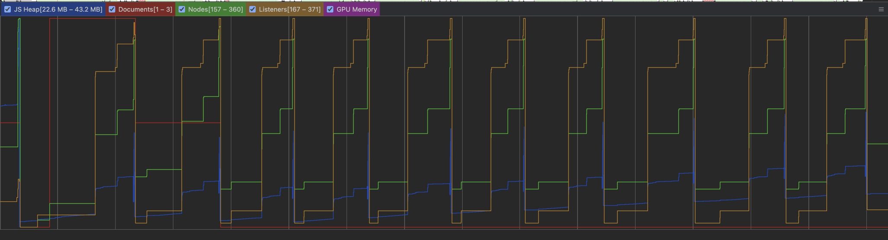

## Обнаруженные утечки памяти и методы их исправления

### 1. Ошибка при удалении обработчика событий

**Расположение:**
`gameHelpers.ts`

**Описание:**
Была допущена ошибка при удалении слушателя события `removeEventListener('click', () => handleStartGameClick);` из-за чего слушатель не удалялся и происходила утечка памяти.

**Решение:**
 Удаление слушателя было перенесено из `gameHelpers.ts` в `Game.tsx.` для использования корректного синтаксиса удаления:
  ```javascript
  canvas.removeEventListener('click', handleStartGame);
  ```

### 2. Утечка памяти в gameLoop

**Расположение:**
`Game.tsx`

**Описание:**
При завершении игры анимация продолжала выполняться, так как `requestAnimationFrame` продолжал вызывать `gameLoop`, даже если `gameOver` установлен в `true`.

**Решение:**
Использование `cancelAnimationFrame` для корректного завершения цикла анимации:
  ```javascript
  useEffect(() => {
    if (gameOver) {
      // ...
      animationId.current && cancelAnimationFrame(animationId.current);
    }
  }, [gameOver]);
```

### 3. Мемоизация функций handleClose и navigateToMain

**Расположение:**
`GameOverModal.tsx`

**Описание:**
Функции `handleClose` и `NavigateToMain`, используемые в обработчиках событий, создавались заново при каждом рендере, что приводило к избыточным вычислениям.

**Решение:**
Компонент `GameOverModal` был обёрнут в `React.memo`, а функции `handleClose` и `navigateMain` были обёрнуты в `useCallback`:
  ```javascript
  export const GameOverModal = React.memo(({ onClose, score }) => {
    // ...
    const handleClose = useCallback((): void => {
      setVisible(false);
      onClose?.();
    }, [onClose]);

    const navigateMain = useCallback((): void => {
      navigate(EAppRoutes.Main);
    }, []);

    // ...
  });
```

Также функция `handleGameOver` в родительском компоненте была обёрнута в `useCallback` для того, чтобы при ререндере родительского компонента не пересоздавалась ссылка в памяти:
  ```javascript
    const handleGameOver = useCallback((): void => {
      setTimeout(() => window.location.reload(), 100);
    }, []);

    // ...

    return <GameOverModal score={score} onClose={handleGameOver} />;
```

---

## График использования памяти
### До изменений


### После изменений


Оба графика иллюстрируют использование памяти приложением при десятикратном запуске игры. На первом графике чётко видна утечка памяти, которая приводит к неэффективному использованию ресурсов. Второй график демонстрирует, что после внедрения исправлений утечка памяти была успешно устранена, обеспечивая стабильную работу приложения без роста потребления памяти.
