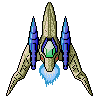
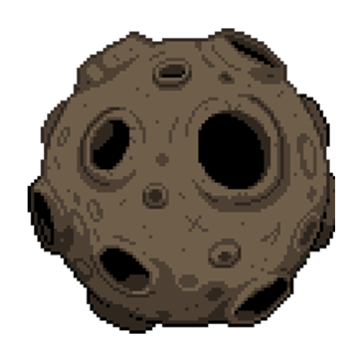

# Сценарий игры <!-- omit in toc -->

Игрок управляет кораблем при помощь мышки по экрану. Корабль так же может стрелять.
Цель игры набрать как можно больше очков, игра бесконечная с постепенно повышающейся сложностью.
Сложность повышается после уничтожения метеоритов.
Разница в уровнях это расположение и скорость метеоритов.
Если метеорит пролетит мимо корабля или врежется в него, то игрок проиграет.

В начале каждого уровня метеориты летят на игрока, перемещаясь с правой
части экрана влево. Скорость метеоритов увеличивается от количества очков.

|             Изображения             | Описание                                                                                                                                                |
| :------------------------------:    | :------------------------------------------------------------------------------------------------------------------------------------------------------ |
|   | Корабль игрока. Передвигается спомощью мышки и стреляет по метеоритам.                                          |
|     | Метеорит. Каждый новый метеорит становится быстрее. Может убить игрока при слокновении                                

_TODO:_

&#9744; Добавить анимации кораблю.

&#9744; Добавить анимации взрыва метеорита и корабля при смерти.

&#9745; Ускорить метеориты от уровня сложности.
